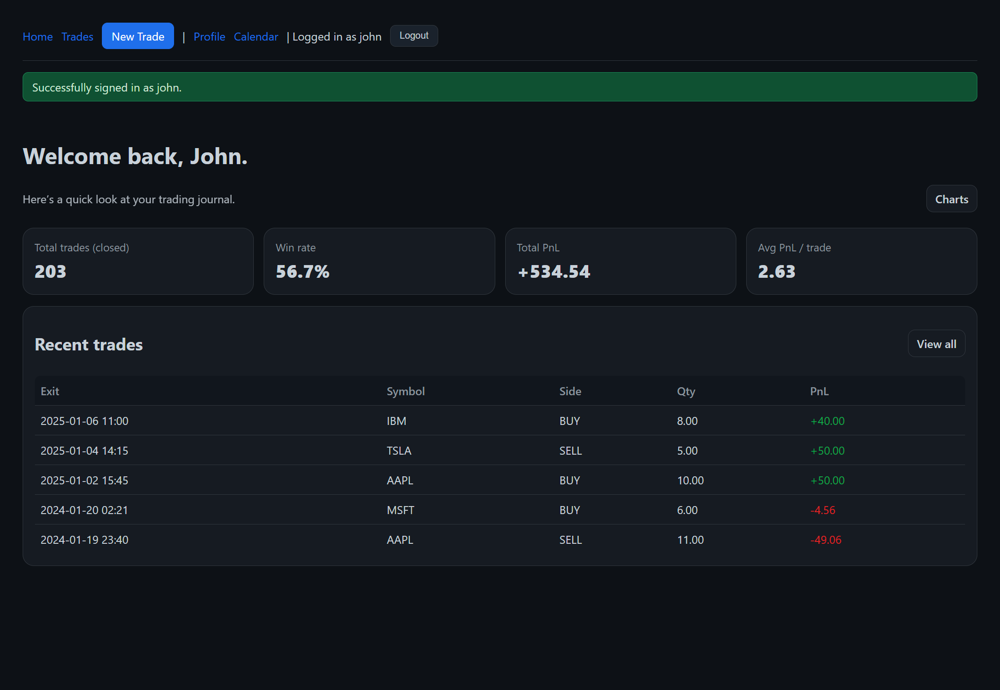
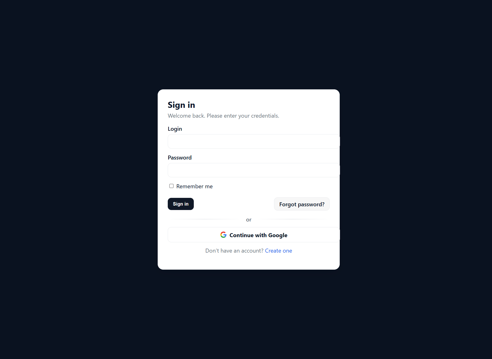
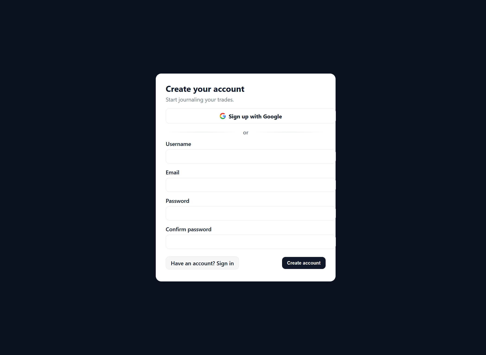
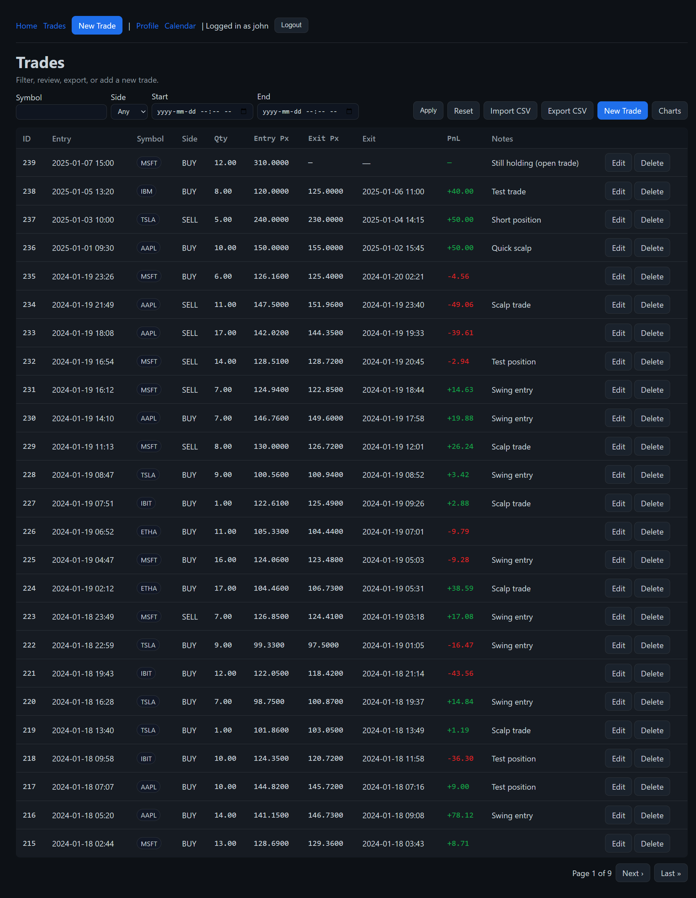
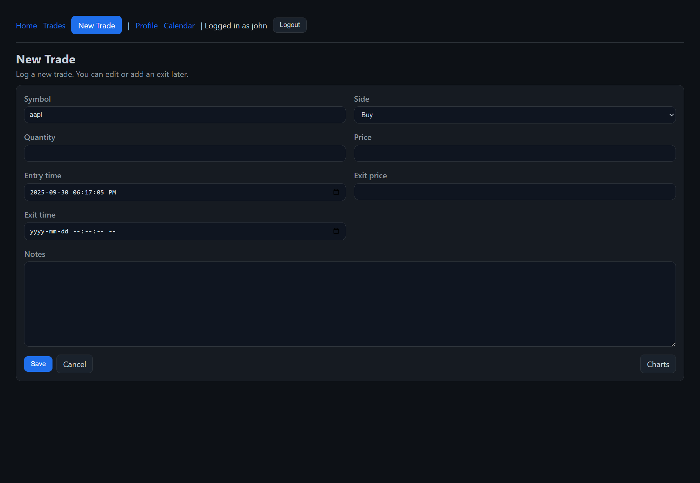
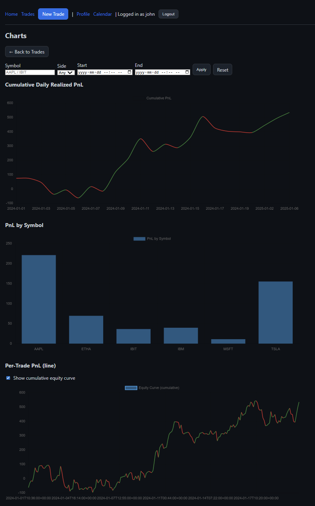
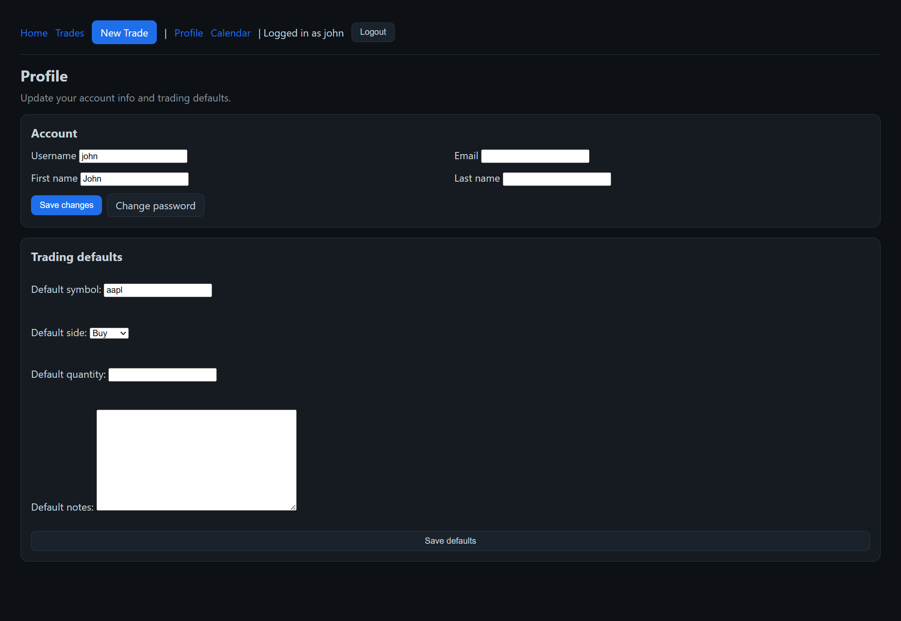
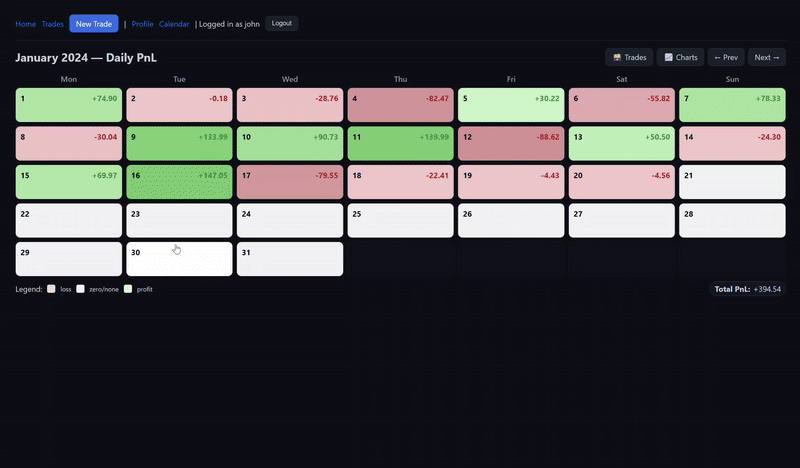
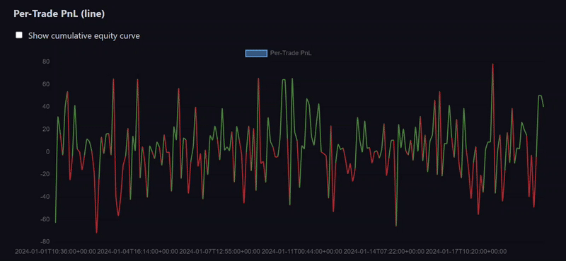

# Trading Journal

A web application for tracking and analyzing trades.  
Built with **Django**, **PostgreSQL**, and **Docker**, this project provides a personal trading journal with charts, calendar views, and CSV/XLSX import/export.

---

## Features

- User authentication (email/password + Google OAuth via Django AllAuth)
- Record trades with symbol, side, entry/exit, notes
- Realized PnL calculation and visualization
- Calendar heatmap of daily PnL
- Charts by day and symbol
- Profile with configurable defaults
- CSV/XLSX import & export
- Responsive dark theme UI

---

## Screenshots

### Home


### Login


### Signup


### Trades List


### New Trade


### Charts


### Profile


### Calendar (GIF demo)


### PnL Chart (GIF demo)


---

## Tech Stack

- **Backend:** Django, Django REST Framework  
- **Frontend:** HTML, CSS (custom dark theme)  
- **Database:** PostgreSQL  
- **Auth:** Django AllAuth (Email + Google OAuth)  
- **Containerization:** Docker, Docker Compose  

---

## Setup

### Prerequisites
- Docker & Docker Compose
- Python 3.11+ (for local development)

### Development Setup
```bash
git clone https://github.com/jojohn01/trading-journal.git
cd trading-journal

# start services
docker compose up --build
```

The app will be available at: [http://localhost:8000](http://localhost:8000)

### Running Tests
```bash
docker compose run --rm web python manage.py test
```

---

## Project Structure

```
trading-journal/
├── journal/           # Main Django app
│   ├── models.py      # Trade and UserTradeSettings
│   ├── views.py       # Core views (CRUD, charts, calendar)
│   └── tests.py       # Unit tests
├── templates/         # HTML templates
├── static/css/        # Custom CSS (auth.css, home.css, etc.)
├── docker-compose.yml
├── Dockerfile
└── README.md
```

---

## Roadmap

- [ ] Add bulk trade editing
- [ ] Add per-trade fees/commissions
- [ ] Export to PDF reports
- [ ] Deploy demo instance (Heroku/Railway/Fly.io)

---

## License

This project is licensed under the [MIT License](LICENSE).
